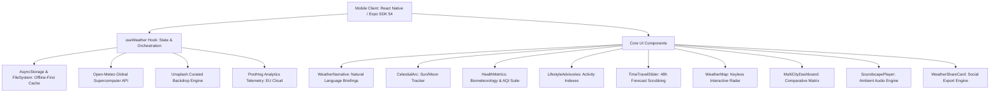

# 🌤️ K & A Weather — Intelligent Meteorological & Biometeorological Suite

<div align="center">


**A next-generation mobile weather application engineered for hyper-local precision, biometeorological atmospheric intelligence, and instant offline responsiveness.**

[Features](#-key-features) • [Architecture](#-system-architecture) • [Component Ecosystem](#-component-ecosystem) • [Getting Started](#-getting-started) • [Deployment & OTA](#-ci--over-the-air-ota-updates) • [Telemetry](#-product-analytics--telemetry)

</div>

---

## 🌟 Overview

**K & A Weather** is a modern, high-performance mobile meteorological suite built with React Native and Expo SDK 54. Designed around an offline-first architecture, the application delivers sub-50ms cold-start loading, serverless client-side data synthesis from global meteorological models (Open-Meteo), and an intuitive glassmorphic design system that responds dynamically to solar positioning and atmospheric conditions.

Beyond standard temperature and precipitation forecasts, K & A Weather provides biometeorological health metrics (joint pain, migraine risk, particulate AQI), lifestyle advisory scoring (running, cycling, stargazing, laundry drying, car washing), and ambient weather soundscapes.

---

## ✨ Key Features

### 🧠 1. AI Weather Narrative & Contextual Briefings
- **Natural Language Summaries**: Generates human-like, time-sensitive briefings (morning, afternoon, evening, night).
- **Day-over-Day Comparisons**: Instant contextual cues explaining whether today feels warmer, cooler, or more humid compared to yesterday.

### ☀️ 2. Celestial Arc & Solar Position Tracker
- **Real-Time Celestial Arc**: Parabolic trajectory tracker visualizing the live position of the sun or moon relative to the horizon.
- **Milestone Timings**: Exact calculations for Sunrise, Golden Hour (Morning & Evening), Solar Noon, Peak UV Hour, Sunset, and Dusk.
- **Lunar Phase Tracking**: Nighttime mode calculating moon visibility and phase.

### 🩺 3. Biometeorological Health Suite
- **🦴 Joint Pain & Arthritis Index**: Monitors rapid drops in barometric pressure combined with high humidity.
- **⚡ Migraine Sensitivity Rating**: Alerts users susceptible to atmospheric pressure shifts.
- **☀️ UV Radiation & Safe Exposure**: Real-time UV index with safe skin exposure estimates.
- **🍃 Air Quality Breakdown (AQI)**: US Air Quality Index with PM2.5, PM10, Ozone, and NO2 metrics.

### 🏃 4. Lifestyle & Activity Suitability Index
- **Running & Jogging**: Evaluates heat stress, air quality, and surface friction.
- **Cycling & Commuting**: Evaluates wind gusts, headwind intensity, and road wetness.
- **Stargazing & Astronomy**: Factors in cloud cover percentage, atmospheric visibility, and lunar illumination.
- **Outdoor Dining & Events**: Analyzes precipitation probability, temperature comfort, and wind breeze.
- **Laundry Drying**: Evaporation rate calculated from solar radiation, wind speed, and humidity.
- **Car Washing**: 48-hour precipitation probability forecast to avoid post-wash rain.

### ⏳ 5. 48-Hour Interactive Time Travel Slider
- **Scrub Through Time**: Drag the interactive time slider forward through 48 hours to preview upcoming temperature curves, cloud cover, and wind transitions before they occur.
- **Dynamic Backdrop Sync**: The UI background and sky gradient dynamically transition according to simulated time and condition codes.

### 🗺️ 6. Interactive Multi-Layer Weather Radar
- **High-Performance Keyless Map**: Embedded interactive Leaflet map powered by Esri World Dark Canvas, OpenStreetMap, and High-Resolution Satellite imagery with zero watermarks and no API keys required.
- **Live Precipitation Radar Overlays**: Satellite Doppler rain and storm overlays.
- **Interactive Spotter Mode**: Tap anywhere on the globe to inspect immediate localized weather coordinates, temperature, wind, and humidity.

### 🏙️ 7. Multi-City Comparative Dashboard
- **Side-by-Side Matrix**: Compare up to 5 saved cities across Temperature, Humidity, Wind, UV, and Air Quality simultaneously.
- **Quick-Access Chips**: Instant switching between favorite cities with haptic-enabled pill filters.

### 🎧 8. Ambient Weather Soundscapes
- **High-Fidelity Audio**: Integrated Expo-AV background player featuring relaxing ambient audio (Rain on Roof, Mountain Wind, Forest Birds, Ocean Swell).
- **Sleep & Focus Companion**: Ambient sounds loop smoothly with native audio session management.

### 📤 9. Social Weather Share Card Generator
- **Visual Card Generator**: Renders beautiful weather snapshot cards with city backdrops, date badges, and full metric breakdowns.
- **Native OS Sharing**: Integrated `Share.share()` sheet to easily post to Instagram, WhatsApp, X/Twitter, or Messages.

### 📴 10. Offline-First Caching & Sub-50ms Cold Starts
- **Dual-Tier Cache**: Immediate hydration from `@react-native-async-storage/async-storage` and `expo-file-system`.
- **Zero-Blank Startup**: Instant rendering of cached forecast snapshots upon launch, guaranteeing full functionality without an active network.

---

## 🏗️ System Architecture



---

## 📁 Project Directory Structure

```
WEATHER_APP/
├── app/                              # Expo Router file-based screens
│   ├── _layout.tsx                   # Root layout, fonts, PostHog provider & error boundaries
│   ├── index.tsx                     # Main weather dashboard & unified scrollview
│   └── +not-found.tsx                # 404 fallback screen
├── assets/                           # Bundled application assets
│   ├── docs/                         # App screenshots & documentation figures
│   └── images/                       # App icons, splash screens, favicons
├── components/                       # Modular UI & intelligence components
│   ├── CelestialArc.tsx              # Sun & Moon trajectory tracker
│   ├── HealthMetrics.tsx             # Biometeorology, joint pain, migraine & AQI
│   ├── LifestyleAdvisories.tsx       # Activity suitability scoring cards
│   ├── MultiCityDashboard.tsx        # Multi-city comparison matrix
│   ├── SettingsModal.tsx             # Application preferences & unit toggles
│   ├── SoundscapePlayer.tsx          # Ambient audio soundscape player
│   ├── TimeTravelSlider.tsx          # 48-hour scrubbing time travel slider
│   ├── WeatherMap.tsx                # Keyless interactive radar & spotter map
│   ├── WeatherNarrative.tsx          # AI morning/evening contextual briefings
│   ├── WeatherOverlay.tsx            # Animated rain/snow/cloud physics overlay
│   └── WeatherShareCard.tsx          # Stylized social weather export card
├── constants/                        # Theme colors, tokens, and style constants
├── hooks/                            # Custom React Hooks
│   ├── useWeather.ts                 # Central data fetcher, cache & state machine
│   └── useColorScheme.ts             # Dark/Light mode theme detector
├── utils/                            # Shared utilities
│   ├── analytics.ts                  # PostHog telemetry & event dispatchers
│   └── haptics.ts                    # Native tactile feedback triggers
├── .github/workflows/
│   └── eas-update.yml                # Automated EAS Over-The-Air deployment CI
├── app.json                          # Expo project configuration & plugins
├── eas.json                          # EAS build profiles (APK, AAB, OTA channels)
├── package.json                      # Project dependencies & scripts
└── tsconfig.json                     # TypeScript configuration
```

---

## 🛠️ Tech Stack & Dependencies

| Layer | Technology | Description |
|---|---|---|
| **Framework** | [React Native 0.81.5](https://reactnative.dev/) | Cross-platform native mobile foundation |
| **Toolchain** | [Expo SDK 54](https://expo.dev/) | Managed runtime, native APIs, and deployment |
| **Routing** | [Expo Router v6](https://docs.expo.dev/router/introduction/) | File-based navigation system |
| **Language** | [TypeScript 5.9.2](https://www.typescriptlang.org/) | Strictly typed static analysis |
| **JS Engine** | Hermes | Bytecode compiled JavaScript engine |
| **Storage** | `@react-native-async-storage/async-storage` | High-performance offline caching |
| **Audio** | `expo-av` | Low-latency ambient soundscape playback |
| **Haptics** | `expo-haptics` | Native tactile interaction feedback |
| **Maps** | `react-native-webview` / Leaflet / Esri | Lightweight, keyless weather radar & maps |
| **Analytics** | `posthog-react-native` | Privacy-focused user telemetry & insights |
| **CI / CD** | GitHub Actions & Expo EAS | Automated Over-The-Air updates on git push |

---

## 🚀 Getting Started

### Prerequisites
- Node.js (v18 or higher recommended)
- npm or yarn
- Expo Go on Android/iOS (or Android Studio / Xcode for development builds)

### 1. Clone & Install Dependencies
```bash
git clone https://github.com/KagereAnthony59/WEATHER_APP.git
cd WEATHER_APP
npm install
```

### 2. Configure Environment Variables
Create a `.env` file in the root directory:
```env
EXPO_PUBLIC_POSTHOG_API_KEY=phc_rnARUT4DVPNsEcoeHTsYFTdABnd9SM9UPWiKHRpTbMis
EXPO_PUBLIC_POSTHOG_HOST=https://eu.i.posthog.com
EXPO_PUBLIC_UNSPLASH_ACCESS_KEY=your_unsplash_access_key
```

*(Note: The app includes built-in fallback keys, ensuring it runs seamlessly even if `.env` is omitted.)*

### 3. Start the Development Server
```bash
npx expo start
```
- Scan the QR code using the **Expo Go** app on Android or iOS.
- Press `a` for Android Emulator or `i` for iOS Simulator.

---

## 🔄 CI & Over-The-Air (OTA) Updates

K & A Weather is configured with **continuous Over-The-Air (OTA) delivery** using Expo Application Services (EAS) and GitHub Actions.

### How it works:
1. Every push to the `main` branch triggers [.github/workflows/eas-update.yml](.github/workflows/eas-update.yml).
2. The GitHub Action packages JavaScript, TypeScript, and asset bundles.
3. EAS publishes the update to the `production` channel.
4. Installed apps seamlessly download the latest features on their next launch without requiring an APK re-install or app store update!

### Building Lightweight Standalone APKs (Android):
```bash
npx eas-cli build -p android --profile preview
```
*Configured in `eas.json` with `arm64-v8a` architecture optimization and R8 ProGuard shrinking to produce lightweight (~22–24MB) APK binaries.*

---

## 📊 Product Analytics & Telemetry

Integrated with **PostHog Cloud (EU)** via [`utils/analytics.ts`](utils/analytics.ts), tracking key engagement metrics without compromising user privacy:
- `weather_viewed`: City name, temperature, weather condition code, AQI.
- `city_searched`: Popular search queries and geocoding hits.
- `temperature_unit_toggled`: Metric (°C) vs Imperial (°F) preferences.
- `weather_shared`: Social card share interactions.
- `multi_city_compared`: Number of cities evaluated in dashboard.

---

## 📄 License

This project is licensed under the MIT License — see the [LICENSE](LICENSE) file for details.

<div align="center">
  <sub>Built with ❤️ by Kagere Anthony and the K & A Engineering Team.</sub>
</div>
